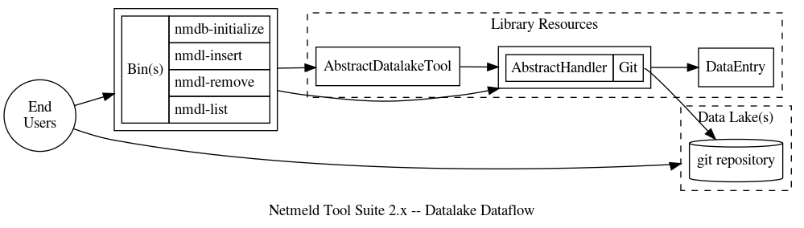

DESCRIPTION
===========

This module provides a set of tools primarily focused to aid in the operations
of getting data into and out of a data lake back-end to allow further operation
by an analyst or other tools.  Due to the nature of a data lake, this also
provides new opportunities to both the analyst and a developer revolving around
the concepts of:
* Further inspection, querying, or processing of raw data
* Analysis of change over time
* Additional capabilities for tool or logic chaining

See the documentation for the library for more information on it specifically.

DATALAKE FUNDAMENTALS
=====================

TYPES AND HANDLERS
------------------

The tools interact with an interface which attempts to be agnostic of the data
lake back-end, so in general the tools provide a common set of functionality
that all data lake back-ends shall possess and support.  However, ultimately
they need to operate on a targeted data lake type and capabilities of those
greatly vary.  Thus, an end user may directly manipulate the data lake as
needed.  If there are stipulations for how data shall be represented in the
data lake for the handler to operate and pass meaningful data back to the tools
as expected, the data lake handler shall clearly outline those requirements.

TARGETED DATE AND TIME
----------------------

Support for tool interactions with the data lake as it exists at present or a
specific date and time in the past shall be supported by all back-ends.
Manipulation, specifically regarding this topic, of the back-end outside of the
tools may lead to unexpected or unintentional outcomes.

TOOL FUNDAMENTALS
=================

COMMON COMMAND-LINE OPTIONS
---------------------------

All of the tools shall support the same base options as defined in the Netmeld
core library, that is:

* `--help`
* `--version`
* `--verbosity`

All of the `nmdl-*` (Netmeld Datalake) tools shall support the following
options:

* `--lake-type`: The Netmeld data lake type to take action on.  This currently
  defaults to a data lake of type `git`.
