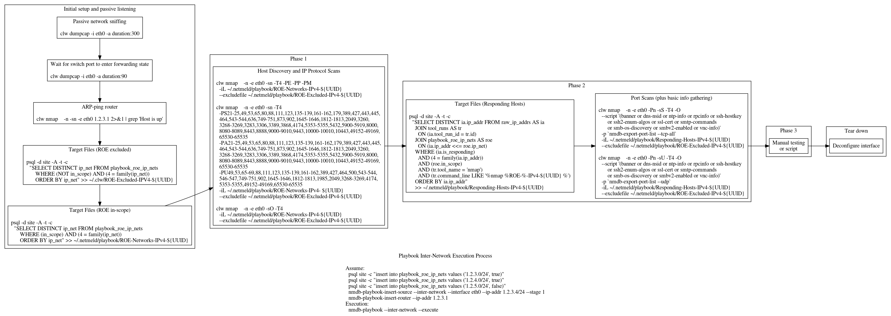

DESCRIPTION
===========

The `nmdb-playbook` tool is utilized to perform the actual playbook runs. The
nmap commands this tool uses can be tuned via the configuration file located at
`/usr/local/etc/netmeld/nmdb-playbook.conf`. At a minimum, the scan type option
has to be provided.

In general, the playbook is broken into stages, phases, and commands.
It is important to note, the `--stage` and `--phase` options
specify which to keep, while the `--exclude-command` option
specifies which to exclude.  All three can be used at the same time.

There are points during a stage where the user is required to provide some
acknowledgment before the playbook will continue.  To date, this is to
facilitate running Nessus and other manual scans concurrently with the
playbook activities.  Specifically, the tool starts an xterm with a notice to
"Close this xterm when manual testing is complete."  The tool will not
deconfigure network interfaces until the playbook scans are complete and the
xterm with this notice is closed.  To ignore this behavior, the `--no-prompt`
option is provided.  It will automatically deconfigure network interfaces as
soon as the relevant playbook scans are complete.  However, if it is used
in conjunction with the `--script` option, a script will be executed in lieu
of the manual testing before the network interface is deconfigured.

General workflow for an intra network playbook execution.


General workflow for an inter network playbook execution.




EXAMPLES
========

Perform a dry-run that displays what the playbook is going to do.  Review this
output as a sanity check.
```
nmdb-playbook --intra-network
nmdb-playbook --inter-network
```

Execute the playbook on the network.
```
nmdb-playbook --intra-network --execute
nmdb-playbook --inter-network --execute
```

Execute a specific stage of the playbook on the network.
```
nmdb-playbook --intra-network --stage 1 --execute
nmdb-playbook --inter-network --stage 1 5 23 --execute
```

Execute a specific phase of stages of the playbook on the network.
```
nmdb-playbook --intra-network --stage 1 8 10 --phase 2 3 --execute
nmdb-playbook --inter-network --phase 1 --execute
```

Exclude specific tests from the playbook on the network.
```
nmdb-playbook --intra-network --exclude-command 1 3 8 9 10
```

From the dry-run output one can identify test ID numbers which can be utilized
to exclude the test from a playbook run.  For example, exclude any test
which uses the `nmap` tool.
```
nmdb-playbook --intra-network \
    --exclude-command $(nmdb-playbook --intra-network | grep nmap \
                        | cut -d ':' -f 1 | paste -sd ' ' -)
```

Execute a script instead of manual testing between stages of the playbook on
the network.
```
nmdb-playbook --inter-network --no-prompt --script post-run-script
```
